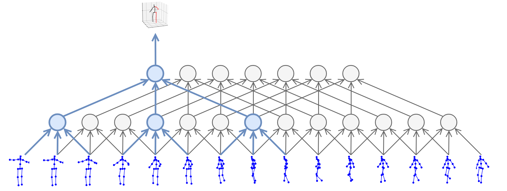
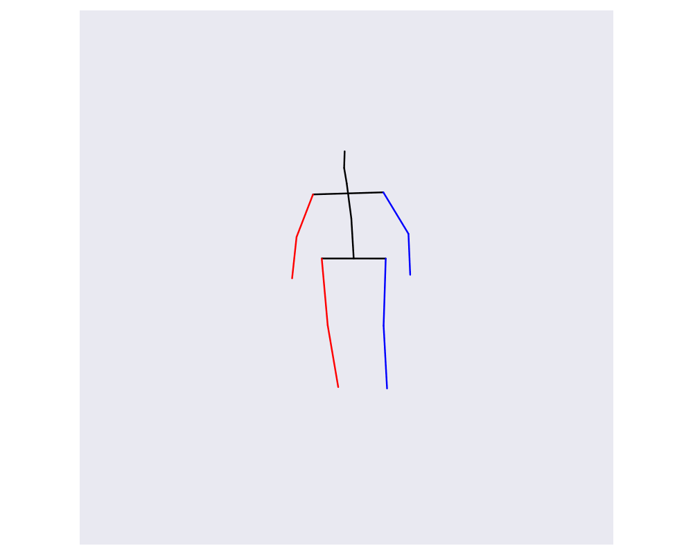

# Real-time 3D Human Pose Estimation

This code uses the design of the following paper, which is implimented in this [Facebook AI Research](https://github.com/facebookresearch/VideoPose3D) respository.

> Dario Pavllo, Christoph Feichtenhofer, David Grangier, and Michael Auli. [3D human pose estimation in video with temporal convolutions and semi-supervised training](https://arxiv.org/abs/1811.11742). In Conference on Computer Vision and Pattern Recognition (CVPR), 2019.

The purpose of this repo is to reformat the "inference in the wild" section from the original code to run in real time from a camera stream.

### Description

The [acapture](https://pypi.org/project/acapture/) library is used for fast image reading from standard webcams, where the images are then passed into a neural network from Facebook's [Detectron2](https://github.com/facebookresearch/detectron2) library to generate predictions of the 2D joint positions. A variable number of these estimates are saved, which a second neural network uses to predict the 3D joint positions for a given frame. Typically, a larger save window will result in more accurate predictions. The video below shows this process.

<p align="center">
  
</p>

To visualize the predictions, blitting in [matplotlib](https://matplotlib.org/) is used to efficiently plot the 3D joint models. The network is intended to operate with a single person in frame.

### Installation
The pretrained temporal model must be downloaded into the `model/` directory. Perform the following commands:

```sh
mkdir model
cd model
wget https://dl.fbaipublicfiles.com/video-pose-3d/pretrained_h36m_detectron_coco.bin
cd ..
```

[Detectron2](https://detectron2.readthedocs.io/en/latest/tutorials/install.html) must be installed and is only available for Linux of macOS. [Pytorch](https://pytorch.org/) should also be downloaded. Ensure that the Pytorch versions are compatible, and the installations match your CUDA version.

All other dependencies can be installed by running the following command. Additionally, a directory for the output files of the program should be created. 

```sh
pip install -r requirements.txt
mkdir out_files
```

### Running the Code
Simply type the command `python run.py` and the program will begin. The `window_size` variable changes the number of images for the temporal convolutional network. Open a new terminal session and run the command `python viz.py` to graph the predictions in real time, which look like the below video. The program writes output files to `out_files/` where `out_files/joints.npy` contains the final joint coordinate predictions. 

<p align="center">
  
</p>

### Additional Information
The output of the file contains 17 joints, each of which have 3 coordinates. Below, a table details the contents of the final output array. An example of an application of this code can be found [here](https://gfloto.github.io/robot.html)

| Index | Location | Index | Location |
|:------:|:-------:| :------:|:------:|
| 0 | Tailbone | 9 | Nose |
| 1 | Right Hip | 10 | Head Crown
| 2 | Right Knee | 11 | Left Shoulder |
| 3 | Right Foot | 12 | Left Elbow |
| 4 | Left Hip | 13 | Left Hand |
| 5 | Left Knee | 14 | Right Shoulder |
| 6 | Left Foot | 15 | Right Elbow |
| 7 | Mid Spine | 16 | Right Hand |
| 8 | Neck | - | - |
